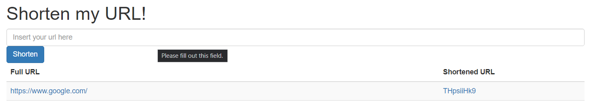

# URL-Shortener

- This is a simple url-shortener built with react frontend (client) and nodejs backend (server)
- As this application has not been deployed yet, you can use it with the following steps
  1. Install `Node.js` and `NPM` [here](https://nodejs.org/en/download/)
  2. Download both `client` and `server` folders and place them in the same directory
  3. Open your terminal and go to the `server` folder
  4. Enter `npm run dev`
  5. Open another terminal and go to the `client` folder
  6. Enter `npm start`
  7. A browser tab with the url `localhost:3000` should open and you can start using the URL-Shortener!

# Lessons learnt

- This was my first time using nodejs hence I was able to learn how to handle fetch requests as well as how to link my frontend with my backend to communication and get/post data that I needed
- This was also my first time using mongodb and I learnt how I am able to create a schema and create a shorturl using a longer one
